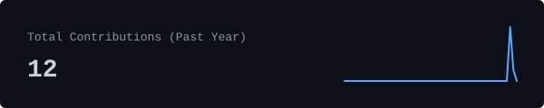

> "Computer Science Student | Digital Project Manager | Creative Technologist specializing in AI & Automation"

  

### About Me

<samp>Asintha Dilhara · Computer Science Student & Digital Project Manager</samp>

I am a dedicated Computer Science student and seasoned digital project manager combining rigorous technical expertise with advanced creative skills [1] [2]. As the founder and lead of <samp>Self_Graphic</samp> (and <samp>Self Graphic Lab</samp>), I direct digital design, multimedia solutions, AI automation systems, and intelligent digital products for clients worldwide [1] [3] [4]. My core interests and competencies span across artificial intelligence, automation, UI/UX engineering, graphic design, 3D modeling, and creative technology [2] [4].

 

### Live Operational Metrics

  
  

  
  
  

 

### Core Stack & Expertise

- **Development & Engineering**: Python, TypeScript, React, Node.js, Frontend & Full-Stack Systems, AI Integration.
- **Project Management & Creative Tech**: Digital Project Management, AI Automation, Workflow Orchestration, UI/UX Design.
- **Multimedia & Design Studio**: Graphic Design, 3D Modeling, Video Editing, Content Creation.

 

### Autonomous Architecture

This GitHub profile is fully self-generating. Every night at 05:17 UTC, a scheduled GitHub Actions workflow checks out this repository, downloads my latest avatar, processes it through background removal and contrast enhancement pipelines to render a fresh ASCII portrait (`portrait.svg`), queries the GitHub GraphQL API for my latest contribution statistics and language breakdowns, generates vector charts (`stats.svg`, `streak.svg`, `langs.svg`, `year.svg`), and commits the updates directly to the repository without third-party web services or rate limits [5].

---

  <samp>© 2026 Asintha Dilhara · Built with Python, GitHub Actions, and SVG</samp>

